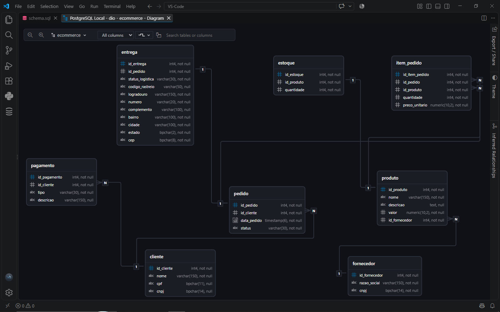

# Projeto E-commerce — Modelagem de Banco de Dados

Projeto desenvolvido como parte do desafio **"Refinando um Projeto Conceitual de Banco de Dados – E-COMMERCE"** da DIO.

O objetivo é transformar os requisitos apresentados no desafio em um modelo de banco de dados relacional, utilizando **PostgreSQL**, com definição de tabelas, chaves, relacionamentos e restrições de integridade.

## Diagrama do relacionamento



## Tecnologias utilizadas

- PostgreSQL
- SQL
- DBCode no Visual Studio Code
- Git / GitHub

## Estrutura do banco

O banco utiliza o schema `ecommerce` e é composto pelas seguintes tabelas:

| Tabela | Finalidade |
|---|---|
| `cliente` | Armazena os dados dos clientes, permitindo CPF ou CNPJ |
| `fornecedor` | Armazena os fornecedores dos produtos |
| `produto` | Cadastro dos produtos comercializados |
| `estoque` | Controle da quantidade disponível de cada produto |
| `pedido` | Registra os pedidos realizados pelos clientes |
| `item_pedido` | Relaciona pedidos e produtos, registrando quantidade e preço praticado |
| `pagamento` | Armazena as formas de pagamento cadastradas pelo cliente |
| `entrega` | Registra os dados logísticos e o endereço utilizado na entrega |

## Principais relacionamentos

### Cliente → Pedido

Um cliente pode realizar vários pedidos.

```text
CLIENTE 1 ───── N PEDIDO
```

### Cliente → Pagamento

Um cliente pode possuir mais de uma forma de pagamento cadastrada.

```text
CLIENTE 1 ───── N PAGAMENTO
```

### Pedido → Entrega

Cada pedido possui uma entrega associada.

```text
PEDIDO 1 ───── 1 ENTREGA
```

A tabela `entrega` registra, entre outras informações:

- `status_logistica`
- `codigo_rastreio`
- logradouro
- número
- complemento
- bairro
- cidade
- estado
- CEP

O endereço da entrega é armazenado no próprio registro da entrega para preservar o endereço utilizado naquele pedido.

### Pedido ↔ Produto

Um pedido pode possuir vários produtos e um produto pode aparecer em vários pedidos.

Essa relação N:N é resolvida pela tabela associativa `item_pedido`:

```text
PEDIDO 1 ───── N ITEM_PEDIDO N ───── 1 PRODUTO
```

Além das chaves estrangeiras, `item_pedido` registra:

- quantidade;
- preço unitário praticado no momento da compra.

O subtotal não é armazenado, pois pode ser calculado por:

```text
quantidade × preco_unitario
```

### Fornecedor → Produto

Um fornecedor pode fornecer vários produtos.

```text
FORNECEDOR 1 ───── N PRODUTO
```

### Produto → Estoque

Cada produto possui um registro de estoque.

```text
PRODUTO 1 ───── 1 ESTOQUE
```

## Regras de integridade implementadas

O projeto utiliza constraints para manter a consistência dos dados.

### Cliente

O cliente deve possuir **CPF ou CNPJ**, mas não os dois simultaneamente.

```sql
CHECK (
    (cpf IS NOT NULL AND cnpj IS NULL)
    OR
    (cpf IS NULL AND cnpj IS NOT NULL)
)
```

### Produto

O valor do produto não pode ser negativo.

```sql
CHECK (valor >= 0)
```

### Estoque

A quantidade em estoque não pode ser negativa.

```sql
CHECK (quantidade >= 0)
```

### Item do pedido

A quantidade deve ser maior que zero e o preço unitário não pode ser negativo.

### Entrega

O modelo prevê validações para estado e CEP, além do controle do status logístico.

## Organização do projeto

```text
projeto-ecommerce/
│
├── README.md
├── ecommerce_schema.png
└── SQL/
    └── ecommerce_schema.sql
```

> Ajuste os caminhos dos arquivos conforme a organização final do seu repositório no GitHub.

## Como executar

1. Instale o PostgreSQL.
2. Crie ou utilize um banco de dados para o projeto.
3. Abra o arquivo `schema.sql` em uma ferramenta de SQL, como o DBCode no Visual Studio Code.
4. Execute o script.
5. O schema `ecommerce` e suas tabelas serão criados no banco.

## Objetivo do projeto

Além de atender ao desafio proposto, este projeto foi desenvolvido para praticar conceitos fundamentais de modelagem e SQL:

- modelagem relacional;
- entidades e relacionamentos;
- cardinalidade;
- chaves primárias;
- chaves estrangeiras;
- tabelas associativas;
- constraints;
- integridade referencial;
- normalização;
- PostgreSQL.

---

**Projeto desenvolvido para fins de estudo e portfólio.**
